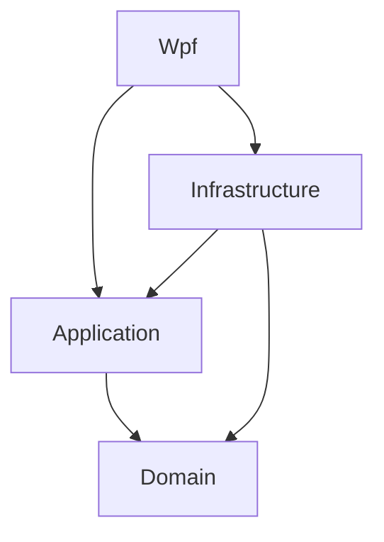

# Архитектура

Проект разделён на слои:

- `MathTutor.Domain` — сущности и enum-ы предметной области без внешних зависимостей.
- `MathTutor.Application` — DTO, интерфейсы сервисов, валидация паролей и контракты сценариев.
- `MathTutor.Infrastructure` — EF Core, SQL Server LocalDB, seed data и реализации application-сервисов.
- `MathTutor.Wpf` — MVVM ViewModel, XAML Views, навигация, дизайн-система и DI Host.
- `tests` — unit и integration тесты.

ViewModel не работает с `DbContext` напрямую: UI вызывает application-интерфейсы, а инфраструктура скрывает EF Core.
