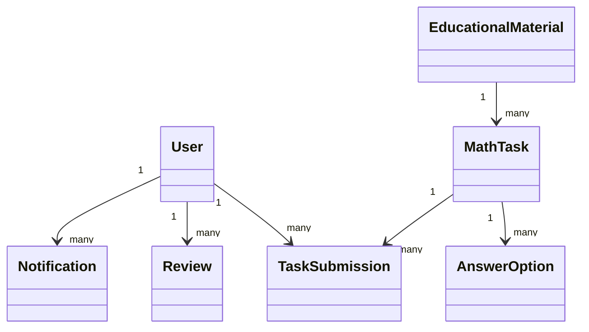

# UML class overview

```mermaid
classDiagram
  class User
  class EducationalMaterial
  class MathTask
  class AnswerOption
  class TaskSubmission
  class Review
  class Notification
  User "1" --> "many" TaskSubmission
  EducationalMaterial "1" --> "many" MathTask
  MathTask "1" --> "many" AnswerOption
  MathTask "1" --> "many" TaskSubmission
  User "1" --> "many" Review
  User "1" --> "many" Notification
```
